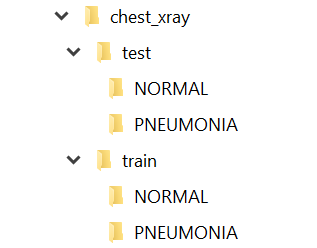
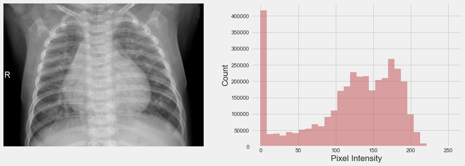
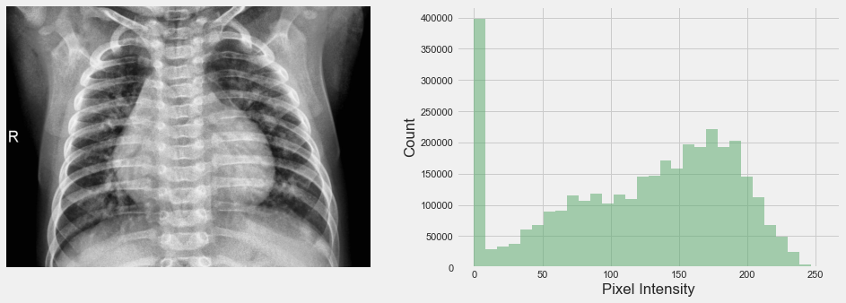
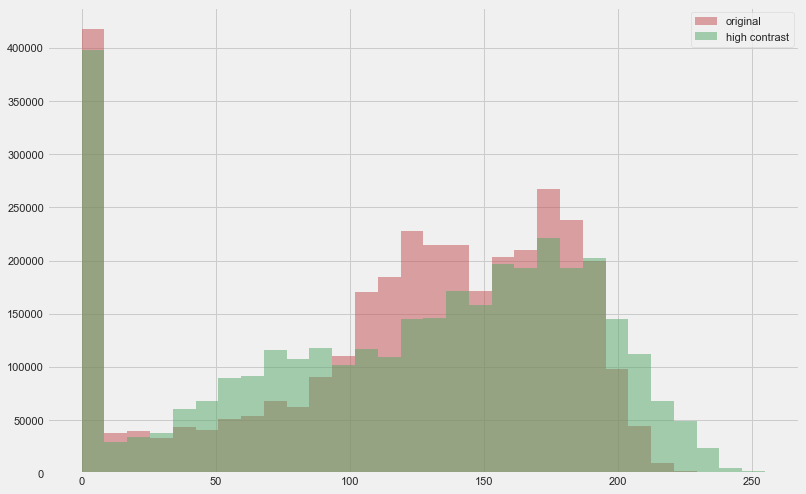
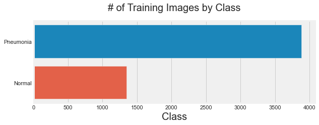
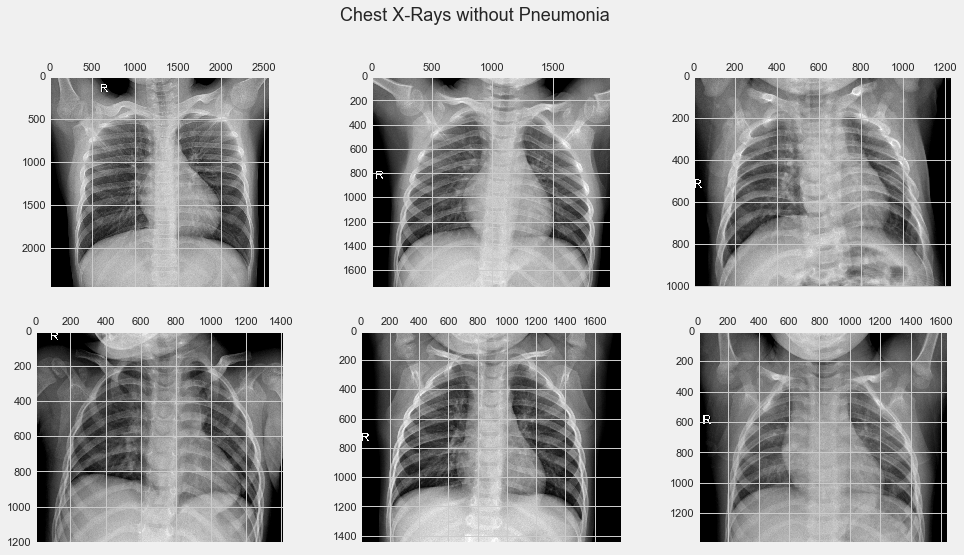
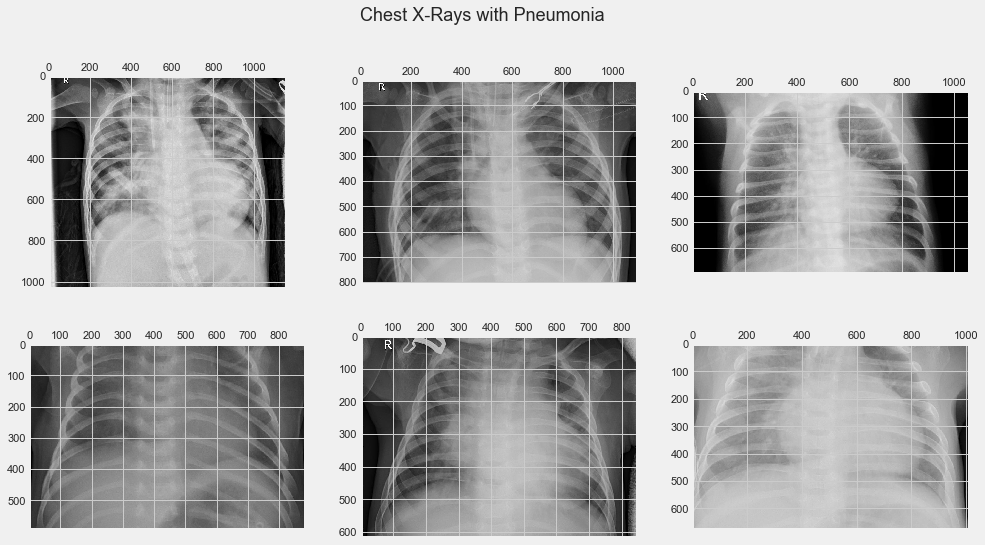
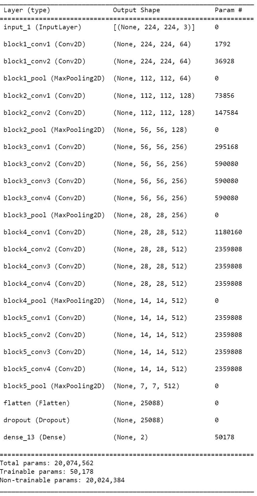
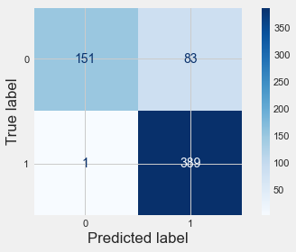

# Detecting Pneumonia in Chest X-Rays with Deep Learning

Flatiron School Phase 4 Data Science Project
Author: Robert Harrow

## Overview

Chest x-ray screening is a reliable method to diagnose pneumonia. However, it requires a radiologist to identify the signs of pneumonia in the images. ACME Radiology would like to leverage computer vision to assist in diagnosing x-ray images. They hire us to develop a model that can achieve this task while attaining some minimum success thresholds.

In this project, we'll iteratively explore different deep learning models using the **Keras** library. We choose this package because it gives us easy access to tools for constructing artificial neural networks that can be used for image classification problems - such as classifying whether an image of a chest x-ray has signs of pneumonia. The project will start with simple Densely connected neural networks, then move on to working with Convolutional Neural Networks (CNNs). CNNs are well equipped for image classification so we expect to achieve best results with these neural nets.

We'll start by designing and implementing our own simple neural networks and train them on our data. **Keras** also allows us to bring in other pre-trained models and leverage **transfer learning** to solve our business problem.

To achieve this, we'll be training and testing our model on over 5,000 images obtained from Kermany et al. We'll train our models on the raw image data as well as pre-processed images through Contrast Limited Adaptive Histogram Equalization (CLAHE). The latter is a technique for increasing image contrast, which we hope will lead to better model performance.


#### Objectives
1. Implement a neural network for classifying X-Ray images to detect pneumonia
2. Iterate through models to achieve at least a 0.90 F1 score

### Evaluation Metrics

We want our models to achieve, at a minimum: **90% F1 score**.

**Why F1?** It's important for our model to not misclassify positive pneumonia cases, so we have some tolerance for false positives. If this was our only goal, **Recall** would be a better metric. However, ACME Radiology also wants this model to act as a resource and time saver. Too many false positives would defeat the purpose of using a model, so we need to also have a model with good **Precision**. **F1** is a harmonic mean of **precision** and **recall**, which makes it the best-suited metric for our business case.

#### F1 Formula
$$ F1 = {2 * Precision x Recall \over Precision + Recall} $$

#### Precision Formula
$$ Precision = {True Positives \over Predicted Positives} $$

#### Recall Formula
$$ Recall = {True Positives \over Actual Total Positives} $$

## Data

The data used in this project comes from Kermany et al. on [Mendeley](https://data.mendeley.com/datasets/rscbjbr9sj/3).

This dataset contains thousands of validated OCT and Chest X-Ray images. For this project, we will only be working with the Chest X-Ray images which are contained in the 'chest_xray' folder. To recreate this repo, download and extract the data, and place the 'chest_xray' folder in the root directory.

The images are already distributed into a 'train' and 'test' folder. Furthermore, each of those folders is subdivided into a 'PNEUMONIA' or 'NORMAL' subfolder which correspond to the two classes we want our model to identify.

#### Directory Structure



### Contrast Limited Adaptive Histogram Equalization (CLAHE)

Histogram Equalization is a type of image processing that increases the global contrast in images. It allows areas of lower contrast to gain a higher contrast. When we visually inspected the images of pneumonia above we saw that while the bones were pretty clear in the images, the virus/bacteria could be a bit more dull (in other words it has a lower range of intensity values).

[Research](https://journals.plos.org/plosone/article?id=10.1371/journal.pone.0265949) published in 2022 showed that using Histogram Equalization led to improved performance of CNNs in image classification tasks for Pneumonia and COVID-19. We will try to implement those here.





#### Class Distribution



There is a mild class imbalance in our training data. We'll account for this when building our models using class_weights in the pre-processing step.

#### Previewing Images
Next, it would be good to see how the normal and pneumonia images look like in case there is anything interesting to learn from inspecting them.




To an untrained eye, these images look similar. One interesting note: it looks like these images are pretty standardized. This isn't surprising since chest x-rays have a format for how they are conducted. That means we probably don't have to worry about creating variations of our images (flipped, rotated, etc.) since they are, for the most part, pretty standard.

### Data Preprocessing

The downloaded data is already split up into train and test folders. However, we would also like to split out about 10% of our train data to be used as a validation set. That way, we can measure our model iterations without touching the test data.

We will also use this opportunity to rescale the image data so it falls between 0 and 1 by dividing pixel intensity by 255.

We do not transform the images beyond that because by visually inspecting the images above, it seems they are all pretty standard. Should we run into issues with our model, we may revisit that in a future step.

#### Setting Class Weights

From our earlier data exploration, we noticed there is a class imbalance present in our dataset. To deal with that, we will use Sklearn's compute_class_weight function to calculate the appropriate weights to balance our classes.


## Modeling

In this project, we ended up building 6 models iteratively. The final and best performing model was VGG-19. You can see the evaluation metrics for each model iteration below.
| Model                       | Accuracy | Precision | Recall | F1   |
|-----------------------------|----------|-----------|--------|------|
| Baseline                    | 0.97     | 0.94      | 0.96   | 0.95 |
| 'Complex' Dense Model       | 0.97     | 0.96      | 0.95   | 0.95 |
| 'Simple' CNN                | 0.97     | 0.97      | 0.92   | 0.94 |
| CNN on High-Contrast X-Rays | 0.97     | 0.99      | 0.87   | 0.93 |
| VGG-19                      | 0.98     | 0.99      | 0.99   | 0.99 |
| ResNet-50                   | 0.97     | 0.99      | 0.97   | 0.98 |

VGG19 is a model that frequently comes up in research surrounding chest x-ray image classification. "VGG-19 is a convolutional neural network that is 19 layers deep. You can load a pre-trained version of the network trained on more than a million images from the ImageNet database" - [MathWorks](https://www.mathworks.com/help/deeplearning/ref/vgg19.html).

This model includes 16 convolution layers, 3 Fully connected layer, 5 MaxPool layers and 1 SoftMax layer.

### About Transfer Learning
## Transfer Learning
Transfer learning is a method whereby we bring in a model that was trained on another dataset and use it to try and solve our problem.

We will use the weights these pre-trained models learned on their original datasets (involving millions of images). These layers will be "frozen" meaning we will not train them on our data. We will then add some output layers to these models on which we will train our chest x-ray data.


### Final Model (VGG19) Architecture


## Final Model Evaluation



Accuracy: 0.865385
Precision: 0.824153
Recall: 0.997436
F1 score: 0.902552
Our final model did worse on the test data, but was still able to meet our F1 score threshold of 0.90. However, the model's precision is quite poor and it misclassified too many normal chest x-rays (83) as having pneumonia.

One potential reason for this is the class imbalance. Our training data did not have an equal number of normal and pneumonia cases. We had to use class_weights to account for this. As ACME collects more normal samples, we should look into re-training this model with a more balanced training set to try and improve performance and increase precision.


## Conclusions
​
* VGG19 was the best model for detecting pneumonia in chest x-rays
* The model achieved an F1 score 0.90 meeting our minimum threshold
* The precision of the model is quite poor (0.82) and it misclassified healthy chest x-rays as having pneumonia
* It's recommended we obtain more normal samples to train our model on to improve this
​

### For more information

See the full analysis in the [Jupyter Notebook](https://github.com/robertharrow/chest-x-ray-images/blob/main/modeling.ipynb) or review this [presentation](https://github.com/robertharrow/modeling-recidivism/blob/main/presentation.pdf).

For additional info, contact Robert Harrow at rharrow928@gmail.com.

### Repository Structure
```
├── images
├── chest_xray
├── chest_xray_contrast
├── logs
├── models
├── README.md
├── presentation.pdf
└── modeling.ipynb
```